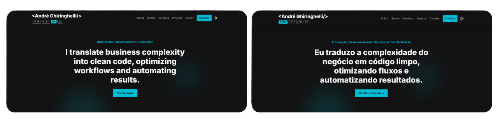
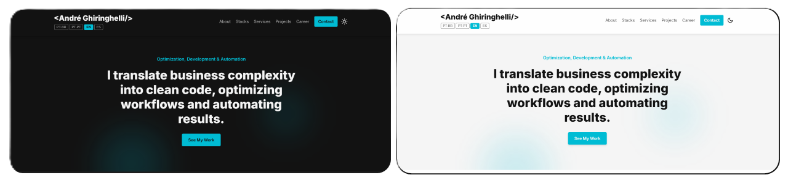

# Portfolio – André Ghiringhelli

A professional portfolio built using pure HTML, CSS, and JavaScript — fully responsive, multilingual, and featuring light/dark theme support.  
This project showcases my background, skills, professional experience, and real business results delivered through process analysis, automation, and development.

---

🌐 Deploy

🔗 https://andre-myportifolio.vercel.app

---

## 📌 About the Project

This repository contains the source code of my professional portfolio, designed to be simple, fast, and entirely maintained using native JavaScript without frameworks.

It includes:

- **Multilingual system** (PT-BR, PT-PT, EN, ES) powered by translation tables in `i18n_data.js`  
- **Dark/Light theme**, persisted via LocalStorage  
- **Responsive mobile menu** with animated hamburger icon (`menu.js`)  
- **Automatic slideshows** inside project cards (`script.js`)  
- **Process Results section** showcasing real operational metrics and performance indicators  
- **Modular structure** separating:  
  - Static HTML  
  - A single CSS file powering the entire website  
  - JavaScript split into menu logic, internationalization, and main functionality  

---

## 🛠️ Technologies Used

- **HTML5**  
- **CSS3** (dark theme, responsive layout, adaptive grid system)  
- **JavaScript (ES6+)**
  - Dark/Light theme control  
  - Internationalization (i18n)  
  - Automatic sliders  
  - Responsive mobile menu  
- **Vercel** (deployment)

---

## 🌍 Key Features

### ✔️ Internationalization (i18n)
The `i18n_data.js` file contains all translations in four languages.  
Users can switch languages via buttons in the header.  
All preferences are saved in **LocalStorage**.

---

### ✔️ Light/Dark Theme
Instant theme switching with persistence.  
Implemented in `script.js`, applied directly to the `<body>` element.

---

### ✔️ Animated Mobile Menu
Implemented in `menu.js`:

- Hamburger icon animation (☰ → ✕)  
- Auto-close after clicking a link  
- Reset to desktop mode when resizing the window  

---

### ✔️ Automatic Project Sliders
Each project card includes:

- Horizontal carousel  
- Automatic 3-second slide transition  
- Fully responsive behavior  

---

### ✔️ Process Results (Business Metrics Showcase)
Highlights real performance indicators from professional process analysis experience, including:

- High-volume record processing metrics  
- Process mapping and publishing indicators  
- Governance, SLA and KPI monitoring metrics  

---

## 📸 Demonstrations

### 🔹 Homepage

   
  

Animated hero section, dynamic tagline, multilingual system and theme switching (Dark / Light).

### 🔹 Sections
- About Me  
- Stacks  
- Services  
- Process Results (real performance metrics and KPI indicators)  
- Projects (with sliders)  
- Professional Timeline  
- Contact cards  

### 🔹 Buono Cookie
Project overview with UI/UX prototypes and solution summary.

### 🔹 Espetinhos FC
Project overview with UI/UX prototypes and solution summary.

---

## 🧩 Roadmap

- Add more detailed project case studies  
- Create a React version (optional future enhancement)  
- Add advanced animations using GSAP or Framer Motion (future Next.js version)  

---

## 👤 Author

**André Luiz Ghiringhelli**  
Process Analyst | Full Stack Developer | RPA | Automation  

  

  

  

